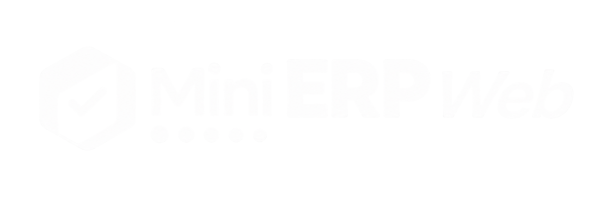
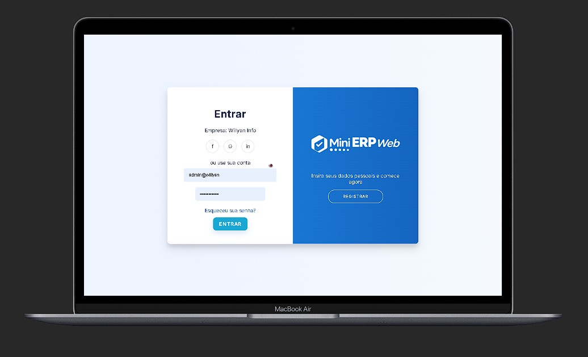
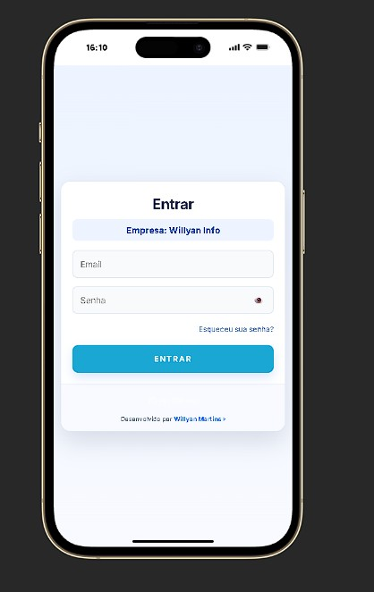

<!-- Hero -->
<p align="center">
  
  <p align="center" style="font-size:1.05rem;opacity:0.9">ERP web multiempresa em PHP + MariaDB — pedidos, fiscais e multi-tenant.</p>

  <p align="center">
    
    
    
  </p>
</p>

<!-- Futuristic showcase -->
## Futuristic showcase ✨🚀

Quer um README que passe credibilidade técnica e sensação de produto de alto nível? Aqui estão melhorias aplicadas e opções para tornar a página mais "futurista":

- Hero animado: usamos `gif_logo.png` como marca animada no topo para impacto imediato.
- Badges dinâmicos: indicadores de versão/stack e status com badges visuais.
- Showcase animado: GIFs curtos (demos rápidas) ou Lottie embed em GitHub Pages para transições suaves.

O que eu posso implementar para deixar mais profissional agora:

1. Thumbnails animados das telas (GIF curto com transição) para a seção de screenshots;
2. Versões anotadas (imagens com setas e chamadas) exportadas como GIF ou PNG de alta resolução;
3. Publicar uma landing visual (GitHub Pages) que consome arquivos Lottie para animações vetoriais leves.

Como funcionaria (opções técnicas):

- GIF simples: gerar a partir das telas com ImageMagick (script automático disponível);
- Lottie + GitHub Pages: hospedar JSON Lottie em `docs/assets/` e inserir via `<script>` numa página do Pages (não executável diretamente no README do GitHub);
- SVG animado: usar SVGs animados (SMIL ou CSS) embutidos em `docs/` para previews interativos.

Se quiser, eu gero os GIFs curtos com transições e atualizo o `README` para mostrar um carrossel (sequência de GIFs). Diga qual opção prefere: `gifs` (rápido) ou `lottie/pages` (mais profissional, requer deploy de Pages). 


---

## Visão geral rápida

MiniERP é uma aplicação web focada em operações comerciais (pedidos) e preparação fiscal
para NF-e/NFC-e. Projetado para ambientes multi-tenant com separação de dados por tenant,
fluxos transacionais e prévias locais de DANFE/DANFC-e.

## Destaques

- Multi-tenant com isolamento por banco;
- Cadastro unificado: pessoas, produtos, transportadoras;
- Fluxo de pedidos com itens, frete, volumes e totais;
- Central de Notas: prévias, XML, timeline e envio (quando configurado);
- Prévia DANFE (55) em A4 e DANFC-e (65) compacta;
- Armazenamento de XML com integridade (SHA-256) quando disponível;
- Módulos de sincronização de catálogo (NCM/contábil) e importadores tabulares.

## Funcionalidades (o que o sistema resolve)

Abaixo há funcionalidades concretas do MiniERP e os problemas reais que elas resolvem para equipes de operação, fiscal e comercial.

- **Multi-tenant com banco por cliente**: permite hospedar múltiplas empresas em um mesmo deploy sem risco de vazamento de dados — Resolve: necessidade de rodar ambientes separados por cliente sem custo operacional elevado.
- **Fluxo de pedido transacional (pedido → documento fiscal interno)**: grava pedidos e cria documentos fiscais em transação única, evitando divergências entre pedidos e notas — Resolve: inconsistências que geram estorno manual ou retrabalho fiscal.
- **Prévia de DANFE/DANFC-e sem certificado (PDF local)**: gera a prévia técnica do documento fiscal sem transmitir à SEFAZ — Resolve: validar layout, campos e impostos antes de usar certificados reais em produção.
- **Alocador de números fiscais e controle de séries**: reserva e aloca faixas de numeração fiscal por série/empresa, evitando colisões — Resolve: riscos de numeração duplicada entre operadores e ambientes (homologação/produção).
- **Armazenamento e verificação de XML com SHA-256**: guarda o XML fiscal e valida sua integridade — Resolve: auditar e provar que o arquivo fiscal não foi alterado após geração.
- **Sincronização de catálogos (NCM, contábil) e importadores tabulares**: importa planilhas CSV/XLS para atualizar catálogo de produtos, NCMs e contas — Resolve: reduzir entrada manual e erros em massa ao alinhar tabelas fiscais e contábeis.
- **Central de Notas com timeline e reprocessamento**: lista estados, eventos e permite re-tentativas controladas — Resolve: tratamento de falhas de transmissão e histórico claro para suporte fiscal.
- **Alertas de estoque e reserva de estoque por pedido**: notifica itens em nível crítico e reserva estoque ao confirmar pedidos — Resolve: evita rupturas e overselling em lojas/marketplaces.
- **Permissões por função e administração por tenant**: roles granulares e painel de plataforma para provisionamento de empresas — Resolve: delegação segura de responsabilidades e segregação de tarefas operacionais.
- **Importadores e exportadores contábeis (planilhas e relatórios)**: exporta informações prontas para contabilidade e integrações — Resolve: diminuir tempo gasto em fechamento fiscal e envio de dados ao contador.
- **APIs simples para integrações (POS, marketplaces)**: endpoints para criar pedidos e sincronizar estoque — Resolve: automação entre canais de venda e redução de lançamentos manuais.


## Galeria de telas e logo

Abaixo estão as imagens e logos já presentes no repositório. Substitua ou adicione novos prints em
`mini-erp-web/public/assets/images/` e atualize os nomes conforme necessário.

<p align="center">
  
  
  
</p>

Se quiser, posso gerar thumbnails e adicionar imagens de cada tela (Dashboard, Pedidos,
Central de Notas, Cadastro de Produtos). Para isso, envie os prints ou autorize-me a capturar
imagens locais se estiverem disponíveis no ambiente de trabalho.

---

## Screenshots detalhados

A seguir estão as capturas reais (desktop, tablet e mobile) organizadas por área. Cada legenda explica brevemente o que a tela mostra.

- **Dashboard (desktop)** — visão analítica com KPIs, filtros por período, cartões de resumo (clientes, pedidos, notas, pendências) e gráficos de faturamento e produtos mais vendidos.

  


- **Painel da Plataforma (desktop)** — administração da plataforma: listagem de empresas, busca, status e ações administrativas (provisionar, acessar ERP do tenant). Ideal para administradores de plataforma e ops.

  

- **Dashboard (tablet)** — versão responsiva do dashboard para tablet com cartões empilhados e gráficos adaptados.

  

- **Dashboard (mobile)** — visão compacta dos KPIs com navegação inferior, cartões empilhados e gráfico resumido para acompanhar faturamento rápido.

  

<!-- removed duplicate Painel da Plataforma (desktop) which is shown above -->

- **Painel da Plataforma (mobile)** — visão mobile do painel de empresas, com botão `+ Nova empresa` e navegação inferior para demais seções administrativas.

  

- **Tela de login (desktop)** — formulário de autenticação com opção de registro e separação visual (card + painel lateral de marca).

  

- **Login (mobile)** — formulário de entrada adaptado para telas pequenas, com campo de seleção da empresa e botão de ação grande para toque.

  

Se desejar, posso:

- gerar thumbnails otimizados e adicioná-los ao diretório `mini-erp-web/public/assets/images`;
- criar uma subpágina de documentação em `docs/screenshots.md` com imagens maiores e anotações por elemento (setas/legendas).
Se desejar, posso:

- gerar thumbnails otimizados e adicioná-los ao diretório `mini-erp-web/public/assets/images`;
- criar uma subpágina de documentação em `docs/screenshots.md` com imagens maiores e anotações por elemento (setas/legendas).

---

## Compatibilidade e suporte

O MiniERP foi pensado para uso em desktops, tablets e dispositivos móveis. Recomendamos as seguintes plataformas para melhor compatibilidade:

- Navegadores desktop: Chrome (últimas 2 versões), Edge (Chromium), Firefox, Safari (macOS).
- Navegadores mobile: Chrome Android, Safari iOS (versões recentes).
- Recomendado: tela mínima de 360x640 para mobile, 768x1024 para tablet, 1280x720 para desktop.

Notas de compatibilidade:

- Funcionalidades de PDF/preview dependem de bibliotecas do servidor e do navegador para abrir novas guias; em dispositivos móveis o PDF pode abrir no visualizador nativo.
- Integração fiscal (transmissão) requer configuração de certificado A1 e ambiente SEFAZ — não é executada nas prévias locais.

## Usabilidade e acessibilidade (UX)

Principais considerações de UX:

- Navegação: menu lateral em desktop e barra inferior em mobile para troca rápida entre seções (Dashboard, Pedidos, Notas, Cadastros).
- Acessibilidade: foco visível em controles, labels nos campos de formulário e estruturas semânticas para melhoria em leitores de tela.
- Touch targets: botões principais têm tamanhos adequados para toque (>=44px) nas views mobile.
- Performance: as páginas usam carregamento assíncrono de gráficos; em bases grandes ative paginação e filtros para reduzir payload.

Recomendações para testes de usabilidade:

- Testar em Chrome Mobile (emulador) e em um dispositivo físico iOS para validar comportamento de PDF e teclado.
- Testar fluxo completo de pedido → prévia → gerar XML em um tenant de teste antes de habilitar transmissão.

---

## Documentação visual (anotações por tela)

Detalhes mais ricos e anotações por elemento estão em [docs/screenshots.md](docs/screenshots.md). Lá há imagens maiores e explicações ponto a ponto (filtros, cards KPI, ações disponíves, comportamento responsivo).

## Quickstart (local)

1. Clone o repositório:

```powershell
cd C:\xampp\htdocs
git clone https://github.com/WillSPACCE/MiniERP-1.0.git MiniRP
cd MiniRP\mini-erp-web
```

2. Instale dependências:

```powershell
composer install
```

3. Configure `mini-erp-web/config.php` com as credenciais do seu MariaDB/XAMPP.

4. Inicie com Apache (XAMPP) ou servidor PHP embutido:

```powershell
# Apache: iniciar via painel XAMPP
# PHP embutido (teste rápido)
C:\xampp\php\php.exe -S 127.0.0.1:8000 -t public
```

Visite `http://127.0.0.1:8000/`.

---

## Boas práticas e aviso fiscal

- Prévias DANFE/DANFC-e são geradas localmente sem certificado; não realizam transmissão real.
- Configure certificado A1, série e ambiente antes de transmitir; siga procedimentos fiscais.

---

## Contribuição

1. Abra uma issue descrevendo sua sugestão ou bug.
2. Crie uma branch com clara intenção: `feature/...` ou `fix/...`.
3. Faça PR com descrição, screenshots e passos para reproduzir.

---

## Licença

Consulte o `composer.json` para detalhes de propriedade. Contate o autor antes de redistribuir.

---

Desenvolvido por <a href="https://github.com/WillSPACCE">WillSPACCE</a>.
