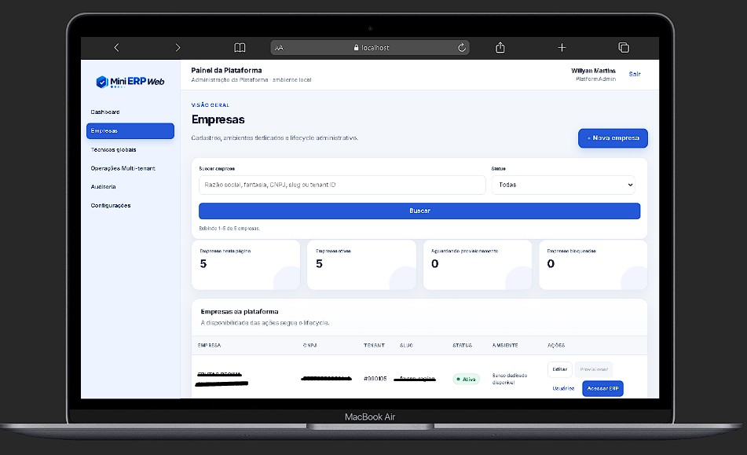
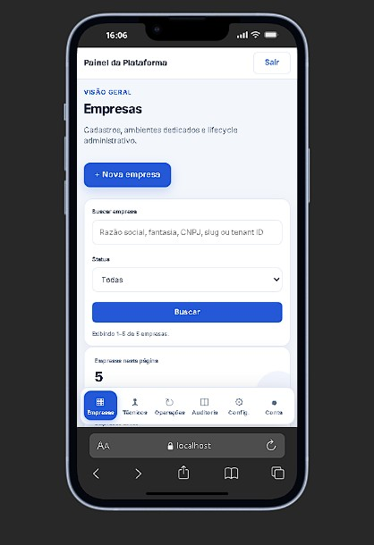

# Painel da Plataforma

Capturas do painel administrativo da plataforma (admin), com listagem de empresas, busca, status e ações.

## Desktop

## Mobile

Observações:

- Permite criar/editar empresas, provisionar tenants e acessar o ERP de cada empresa.
- A navegação inferior na versão mobile facilita acesso rápido às seções administrativas.
